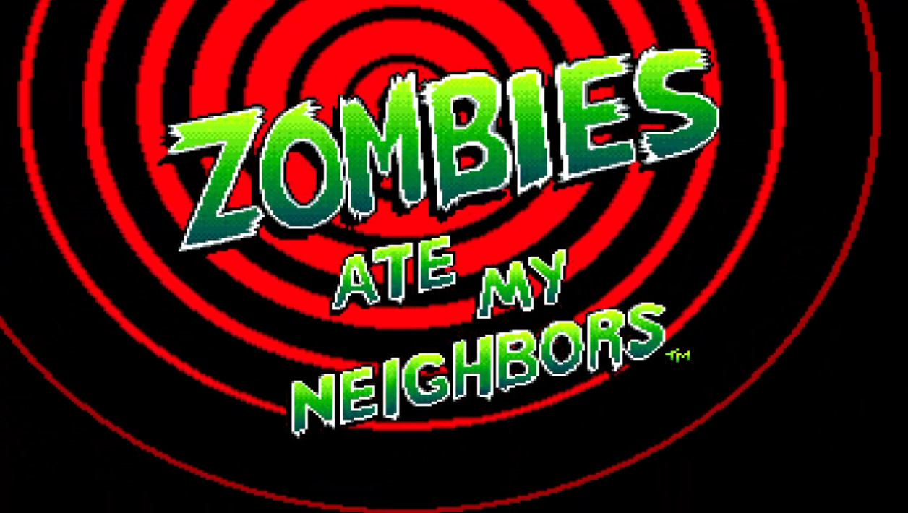

# Zombies Ate My Neighbors PC Port

An unofficial PC port of the 1993 SNES game *[Zombies Ate My Neighbors](https://en.wikipedia.org/wiki/Zombies_Ate_My_Neighbors)*.

It plays like the original game, with some additional features:

* Widescreen support for 16:9, 16:10, and 21:9
* Smoother motion on high refresh rate displays
* USB controller support with twin-stick movement and aiming
* Item and weapon cycling in both directions
* Increased hitbox sizes for neighbors and items
* Quick saving and quick loading
* Top scores are saved between sessions
* Skip the intro, or start the game on any level
* Sound effects that are not played or get cut off in the original game can now be heard
* Optional cheats: invincibility, all weapons / items, infinite ammo / uses, and more

## Gameplay Video

## ROM (Required)

No game data is included.

You will need to obtain a copy of the original ROM:

| | |
| --- | --- |
| Region | USA |
| Size | 1,048,576 bytes |
| MD5 | `23c2af7897d9384c4791189b68c142eb` |
| SHA-1 | `1be79496d7a38b293d6a5d9fba0e16f3cb37d5ff` |
| SHA-256 | `b27e2e957fa760f4f483e2af30e03062034a6c0066984f2e284cc2cb430b2059` |

## Playing

Download the latest release. (COMING SOON!)

After extracting, run `zamn_launcher.exe`.

Choose your ROM file under game settings, change any other setting you like, then press **Play**. 

The launcher saves settings to `zamn.ini`.

Be warned that playing in widescreen makes the game much more difficult, as the neighbors are exposed sooner and can remain visible for longer on the screen.

## Generative AI Usage Disclaimer

Every line of code in this port has been generated using either Claude Code or Codex.

## Port Progress

The port is fully playable, but is very much a work in progress.

The game's logic is being rewritten in C and validated against original ROM execution.

Some of the game is still being emulated, and only a very small portion of what is running natively has been translated into what could be called "readable" C.

## Credits

* [zelda3](https://github.com/snesrev/zelda3) - reference for SNES port architecture
* [LakeSnes](https://github.com/elzo-d/LakeSnes) - used to emulate the original hardware and validate the port
* [Necrofy](https://github.com/Piranhaplant/Necrofy) - reference for ROM data format
* [Zombies Ate My Neighbors DX](https://github.com/JamesIV4/zombies-ate-my-neighbors-dx) - the inspiration for twin-stick controls and hitbox changes
* [Bloody Disgusting ROM Hack](https://www.romhacking.net/hacks/4306/) - inspiration for game over blood color setting
* [Reverse Inventory Cycling ROM Hack](https://www.romhacking.net/hacks/4318/) - inspiration for inventory cycling setting